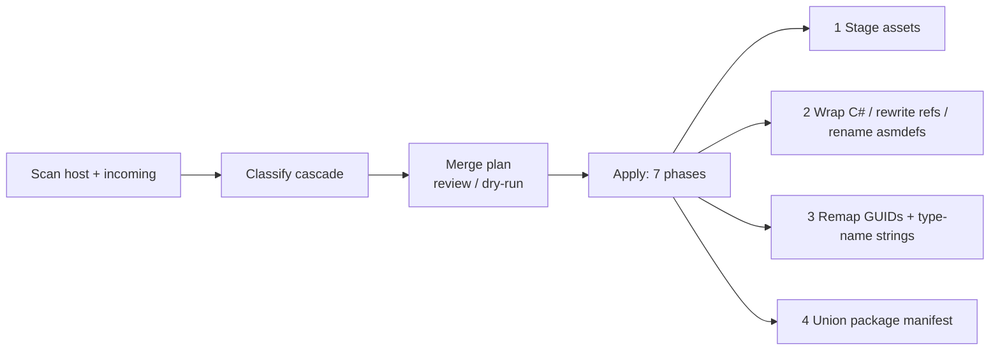

# Fuze — Conflict-Aware Merging & Migration of Unity Projects

> Merge or migrate one Unity project into another **without breaking references.**

Fuze is a set of Unity Editor tools that combine two independently developed Unity
projects into one — preserving referential integrity end to end. It indexes both
projects, classifies every incoming asset against the host, shows you a reviewable
merge plan, and on apply stages assets in isolation, isolates colliding C# code in a
synthetic namespace, renames colliding assembly definitions, and rewrites every kind
of cross-reference (GUIDs, assembly-qualified type names, and package dependencies).

Everything runs **inside the Editor**, is **previewable** (dry-run), **additive**
(the host project is never overwritten), and **idempotent** (safe to re-run).

---

## Why this is hard

Unity identifies every asset by a **GUID** stored in a sidecar `.meta` file, and it
wires scenes, prefabs, and serialized objects together by storing those GUIDs — not
file paths — inside YAML. That makes a project robust to file moves, but it makes a
naive merge fail in subtle, silent ways:

| Naive action | Failure it causes |
| --- | --- |
| Copy assets keeping GUIDs | GUID collisions; imported scenes rebind to **host** assets |
| Copy assets with fresh GUIDs | Intra-project references dangle; objects show as *Missing* |
| Copy scripts into `Assembly-CSharp` | `CS0101` duplicate-type errors; scene script refs blanked |
| Copy an `.asmdef` verbatim | Duplicate assembly name; whole project fails to compile |
| Rewrite GUIDs only | `UnityEvent` / `SerializeReference` type strings still stale |
| Overwrite `Packages/manifest.json` | Host-only package dependencies silently dropped |

Fuze defends against every one of these.

---

## Features

- **Deterministic classification cascade** — matches each incoming asset to the host
  by GUID, exact content hash, normalized-text hash (BOM/CRLF/whitespace tolerant),
  C# type-name collision, path, and **perceptual texture hash** (dHash) for
  re-exported images.
- **Namespace isolation** — wraps imported C# in a synthetic `Imported_<Project>`
  namespace (preprocessor-aware), then repairs cross-file references with a
  scope-aware tokenizer that ignores strings and comments.
- **Three-layer reference repair** — GUID references in YAML, assembly-qualified type
  names in `UnityEvent` / `SerializeReference`, and `.asmdef` names/references.
- **Reviewable & safe** — four guided steps, a filterable side-by-side diff, a
  **dry-run**, Markdown/CSV report export, and per-conflict overrides. Apply is gated
  until every conflict is resolved.
- **Additive & idempotent** — imported assets land in an isolated `Assets/_Imported/`
  subtree; re-running converges instead of producing duplicates.
- **Scales** — `O(H + I)` hash-indexed classification, streaming hashes, GPU-assisted
  perceptual hashing, and a virtualized conflict list that handles tens of thousands
  of entries.
- **Zero external dependencies** — pure Editor scripts; drops into any project.

---

## Requirements

- **Unity 2019.4 LTS or newer** (uses assembly definitions and standard Editor APIs).
- Editor-only — nothing ships in your build.
- **Commit to version control before merging.** Apply is one-way; Fuze relies on you
  having a clean checkpoint.

---

## Installation

Copy the tool into the **host** project (the one you're merging *into*):

```
<host project>/Assets/Editor/Fuze/
```

That's it — drag the `Assets/Editor/Fuze` folder from this repo into your project's
`Assets/Editor/`. Unity compiles it into the `ProjectMerger.Editor` assembly and the
tools appear under the **`Tools ▸ Fuze`** menu.

---

## Usage

### The main merge — `Tools ▸ Fuze ▸ Open…`

A four-step wizard. **Nothing is written to disk until the final Apply.**

1. **Source** — point at the root of the incoming Unity project (read in place, no
   export needed). Set import filters and scope toggles (include `ProjectSettings/`,
   include `Packages/`).
2. **Scan** — both projects are indexed and a merge plan is built; counts are reported
   per status.
3. **Resolve** — review each entry with a side-by-side diff (image preview or text
   head). Accept the proposed resolution or override it; bulk-resolve filtered groups.
4. **Review** — see a summary, toggle namespace isolation, export a Markdown/CSV
   report, run a **dry-run**, then **Apply** (with confirmation).

Imported `Assets/` content lands under `Assets/_Imported/<ProjectName>/`. Your host
project is left byte-for-byte unchanged except for well-defined, additive merge points.

### Supporting tools

| Menu item | What it does |
| --- | --- |
| `Tools ▸ Fuze ▸ Open…` | The full four-step project merge (primary tool). |
| `Tools ▸ Fuze ▸ Import Scripts…` | Copy and namespace-isolate a hand-picked set of C# files only. |
| `Tools ▸ Fuze ▸ Find duplicate scripts…` | Locate and remove duplicate scripts left by an earlier merge. |
| `Tools ▸ Fuze ▸ Merge Package Manifest…` | Compare and union `manifest.json` dependency sets. |
| `Tools ▸ Fuze ▸ Export Project…` | Export the current project as a filtered folder tree or `.unitypackage`. |

---

## How it works



On apply, the execution engine runs seven phases: **stage** assets into the isolated
subtree → **wrap** eligible scripts and **refactor** their references → rewrite staged
**`.asmdef`** files → **remap GUIDs** across copied YAML → rewrite **assembly-qualified
type-name strings** → **union** the package manifest. Each phase is gated and skipped
when it has no work, and the whole run honors the dry-run flag.

For the full design — data structures, algorithms, failure modes, and idempotency
guarantees — see the paper.

---

## Architecture

Two layers: pure, testable logic in `Core/`; thin Editor windows in `UI/`.

### `Assets/Editor/Fuze/Core/`

| File | Responsibility |
| --- | --- |
| `ProjectScanner.cs` | Walk a project tree; emit one `AssetRecord` per file. |
| `AssetRecord.cs` | Per-asset facts: path, GUID, hashes, kind, assembly ownership, declared types. |
| `HashUtil.cs` | Exact hash, normalized-text hash, perceptual dHash, Hamming distance. |
| `MergeClassifier.cs` | Compare the two indexes; build the classified merge plan. |
| `MergePlan.cs` | Entries, GUID-remap table, assembly-rename table, wrap settings. |
| `MergeEngine.cs` | Apply a plan in seven phases. |
| `ScriptNamespaceWrapper.cs` | Wrap C# in a namespace; rewrite cross-file references. |
| `AsmdefRefactor.cs` | Rewrite `.asmdef` name, root namespace, and references. |
| `GuidRemapper.cs` | Rewrite 32-hex GUID references in YAML and `.meta` files. |
| `YamlTypeRefactor.cs` | Rewrite assembly-qualified type names in `UnityEvent` / `SerializeReference`. |
| `ManifestMerger.cs` / `ManifestExclusions.cs` | Parse, compare, and union package-manifest dependencies. |
| `ProjectExporter.cs` | Export a filtered folder tree or `.unitypackage`. |
| `ExclusionList.cs` | Reusable scan/export/import filters. |
| `DryRunReport.cs` | Render a plan as a Markdown or CSV report. |

### `Assets/Editor/Fuze/UI/`

`ProjectMergerWindow.cs` · `ScriptImporterWindow.cs` · `ScriptDuplicateFinderWindow.cs`
· `PackageManifestMergerWindow.cs` · `ProjectExporterWindow.cs`

---

## Limitations

- C# wrapping/reference rewriting uses **lexical** analysis, not a full parser. It
  handles strings, comments, verbatim/interpolated strings, and preprocessor nesting,
  but pathological constructs could still be miscounted.
- No type-reference rewriting **inside method bodies** for no-namespace types
  (deliberate, to avoid touching like-named locals/fields).
- `ProjectSettings/` conflicts are surfaced and resolved **whole-file**, not merged
  key-by-key.
- Manifest version conflicts keep the host version (logged); no semantic-version
  reconciliation.
- **Not reversible from within the tool** — commit to version control first.
- Binary assets (DLLs, FBX, audio) are copied, not analyzed.

See the paper's *Future Work* for the roadmap (Roslyn-based analysis, key-level
settings merge, undo journal, headless CI mode, and more).

---

## Paper

The concepts and algorithms behind Fuze are documented in a standalone, implementation-
agnostic research paper included in this repo:

- [`Fuze-Unity-Project-Migration.pdf`](Fuze-Unity-Project-Migration.pdf)
- LaTeX source (arXiv submission) under [`arxiv/`](arxiv/)

---

## License

No license file is currently included. Add one (e.g. `LICENSE` with MIT) before
publishing publicly, or state your intended terms here.
